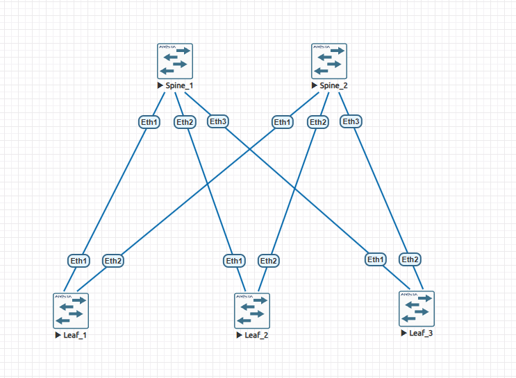
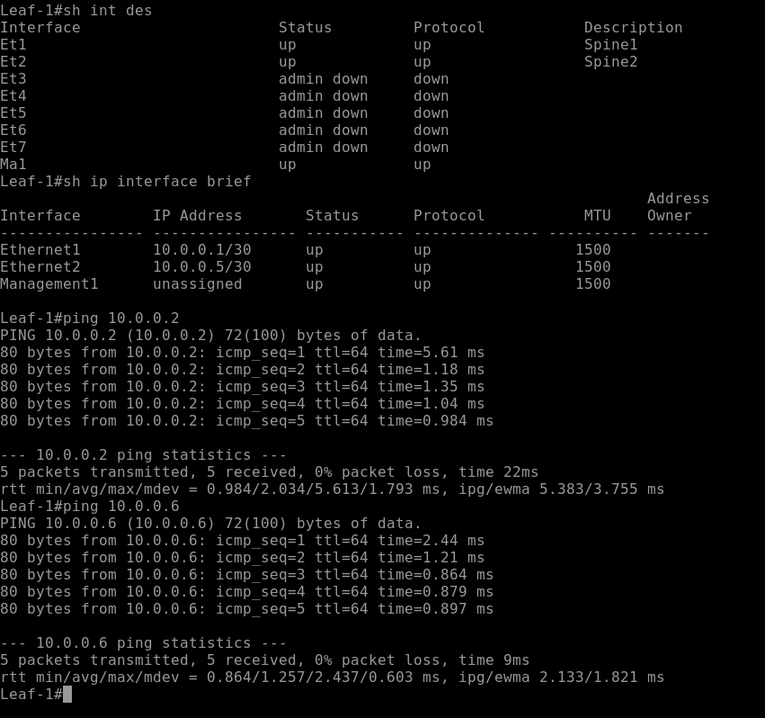
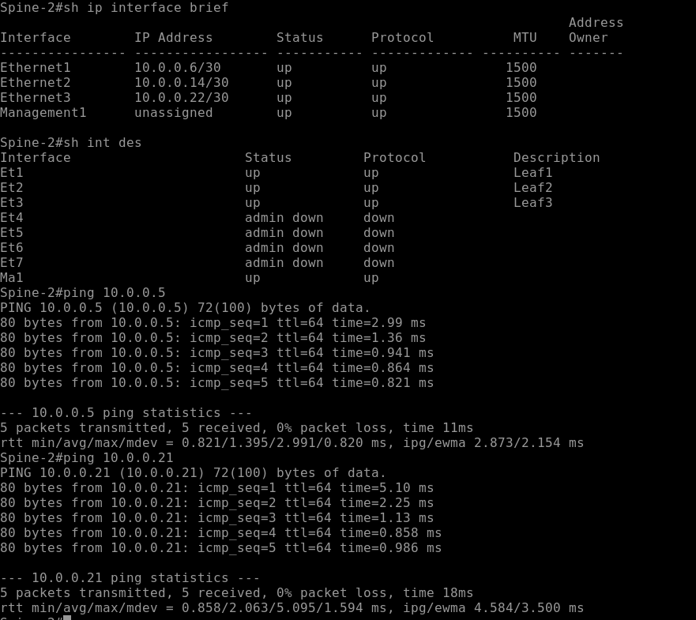

# Лабораторная работа №1. Проектирование адресного пространства

## Цель

Собрать топологию CLOS и распределить адресное пространство для Underlay-сети.

## Схема сети

Лабораторный стенд собран в EVE-NG на базе Arista vEOS.

В топологии используются:

- 2 Spine-коммутатора;
- 3 Leaf-коммутатора;
- 6 point-to-point соединений Leaf–Spine.



## Адресный план

Для построения Underlay-сети выделен пул транзитных адресов `10.0.0.0/24`.

Для каждого point-to-point соединения Leaf–Spine используется отдельная подсеть `/30`.

Маска `/30` выбрана вместо `/31` для обеспечения совместимости с оборудованием, которое может не поддерживать `/31`. Адреса всех транзитных соединений выделяются из единого пула, что позволяет сохранить унифицированную структуру адресного пространства.

В каждой подсети `/30` первый доступный IP-адрес назначается Leaf, второй — Spine.

| Leaf | Интерфейс | IP-адрес | Spine | Интерфейс | IP-адрес | Подсеть |
|---|---|---|---|---|---|---|
| Leaf1 | Et1 | `10.0.0.1/30` | Spine1 | Et1 | `10.0.0.2/30` | `10.0.0.0/30` |
| Leaf1 | Et2 | `10.0.0.5/30` | Spine2 | Et1 | `10.0.0.6/30` | `10.0.0.4/30` |
| Leaf2 | Et1 | `10.0.0.9/30` | Spine1 | Et2 | `10.0.0.10/30` | `10.0.0.8/30` |
| Leaf2 | Et2 | `10.0.0.13/30` | Spine2 | Et2 | `10.0.0.14/30` | `10.0.0.12/30` |
| Leaf3 | Et1 | `10.0.0.17/30` | Spine1 | Et3 | `10.0.0.18/30` | `10.0.0.16/30` |
| Leaf3 | Et2 | `10.0.0.21/30` | Spine2 | Et3 | `10.0.0.22/30` | `10.0.0.20/30` |

## План работ

1. Собрать CLOS-топологию из двух Spine и трёх Leaf.
2. Соединить каждый Leaf с каждым Spine.
3. Выделить адресное пространство для Underlay.
4. Перевести интерфейсы Leaf–Spine в L3-режим.
5. Назначить IP-адреса согласно адресному плану.
6. Добавить описания интерфейсов.
7. Проверить состояние интерфейсов.
8. Проверить IP-связность между непосредственно подключёнными устройствами.

## Настройка интерфейсов

Пример настройки Leaf1:

```text
interface Ethernet1
   description Spine1
   no switchport
   ip address 10.0.0.1/30

interface Ethernet2
   description Spine2
   no switchport
   ip address 10.0.0.5/30
```

Пример настройки Spine2:

```text
interface Ethernet1
   description Leaf1
   no switchport
   ip address 10.0.0.6/30

interface Ethernet2
   description Leaf2
   no switchport
   ip address 10.0.0.14/30

interface Ethernet3
   description Leaf3
   no switchport
   ip address 10.0.0.22/30
```

Полные конфигурации устройств находятся в директории `configs`.

## Проверка

После настройки проверено состояние интерфейсов и IP-адресация.

Пример Leaf1:

```text
Interface       IP Address       Status     Protocol
Ethernet1       10.0.0.1/30      up         up
Ethernet2       10.0.0.5/30      up         up
```

Выполнена проверка доступности непосредственно подключённых Spine:

```text
Leaf-1# ping 10.0.0.2
5 packets transmitted, 5 received, 0% packet loss

Leaf-1# ping 10.0.0.6
5 packets transmitted, 5 received, 0% packet loss
```

Проверка со стороны Spine2:

```text
Spine-2# ping 10.0.0.5
5 packets transmitted, 5 received, 0% packet loss

Spine-2# ping 10.0.0.21
5 packets transmitted, 5 received, 0% packet loss
```

### Скриншоты проверки

Leaf1:



Spine2:



## Результат

Собрана CLOS-топология из двух Spine и трёх Leaf-коммутаторов.

Для шести point-to-point соединений разработан и применён адресный план из пула `10.0.0.0/24` с использованием подсетей `/30`.

Все настроенные соединения Leaf–Spine находятся в состоянии `up/up`. IP-связность между непосредственно подключёнными устройствами проверена с помощью ICMP.
